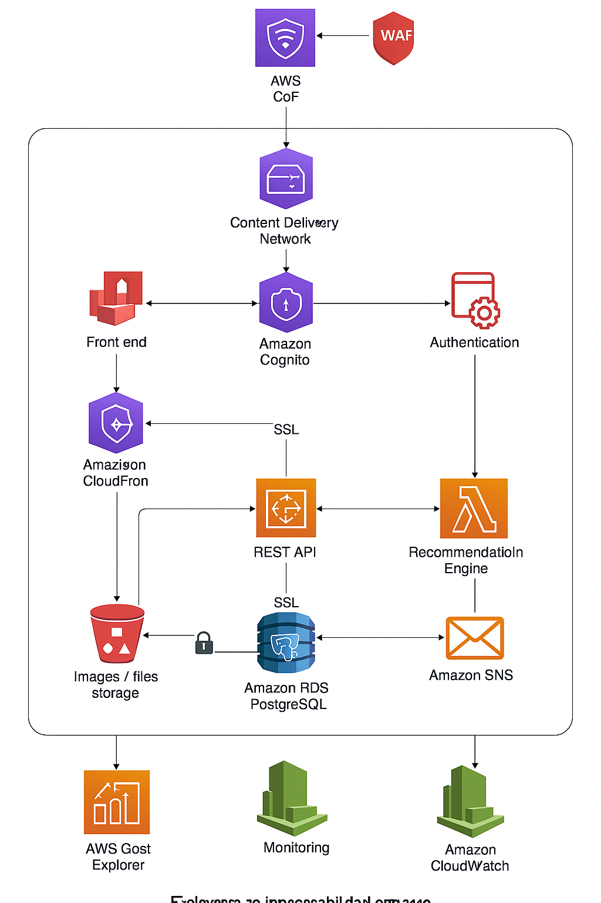

# Análisis de Seguridad y Costos en Arquitectura AWS para Vinotech

## 1. Análisis de Vulnerabilidades de Seguridad

### a. Exposición Inadecuada de Servicios
- API REST sin protección de capa 7 (sin WAF ni AWS Shield).
- Bucket S3 público, con riesgo de acceso no autorizado y manipulación de datos.

### b. Gestión Deficiente de Credenciales y Roles
- Secrets embebidos directamente en el código fuente.
- Uso de políticas IAM con privilegios excesivos (`AdministratorAccess`).
- No hay rotación de claves ni uso de MFA para accesos sensibles.

### c. Autenticación Insegura
- Implementación casera de login sin MFA.
- Falta de uso de estándares modernos como OAuth2 o Amazon Cognito.

### d. Falta de Observabilidad y Prevención de Amenazas
- No se utilizan servicios clave como AWS Config, CloudTrail o Security Hub.
- No hay alertas tempranas ni detección de comportamientos anómalos.

---

## 2. Fuentes de Gasto Innecesario

| Componente           | Problema                               | Impacto | Alternativa Sugerida                                   |
|----------------------|----------------------------------------|---------|--------------------------------------------------------|
| EC2 (motor de recomendaciones) | Uso 24/7 sin autoapagado ni spot      | Alto    | Lambda con procesamiento Batch o EC2 Spot + SQS       |
| RDS PostgreSQL       | 1 sola AZ y modalidad on-demand        | Medio   | RDS Multi-AZ con instancias reservadas                |
| ECS Fargate          | Escalado mal configurado               | Medio   | Auto Scaling optimizado o migración a Lambda si aplica|
| Tráfico de Bots      | Scraping sin control                   | Alto    | WAF con reglas de rate limiting + Bot Control         |
| Falta de tagging     | Sin visibilidad por ambiente           | Medio   | Etiquetado automatizado (Cost Allocation Tags)        |
| Sin Cost Explorer    | No hay control ni alertas de gasto     | Alto    | Activar Cost Explorer + Budgets + Anomaly Detection   |

---

## 3. Diagrama de Arquitectura Mejorada (AWS)

